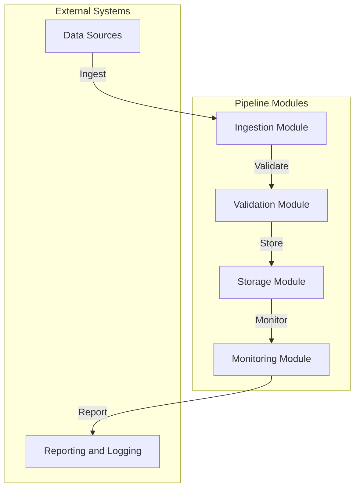
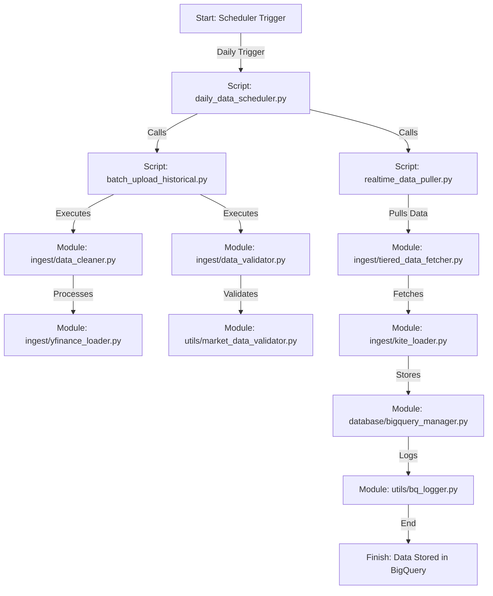

# Trading Data Pipeline - Comprehensive Guide

## Overview
The Trading Data Pipeline is a modular system designed for ingesting, validating, and storing financial market data from multiple sources. This guide provides a detailed walkthrough of the project structure, including all files and their purposes.

## Project Structure

```
trading-data-pipeline/
├── bin/                     # Executable scripts for pipeline operations
│   ├── batch_upload_historical.py  # Batch upload historical market data
│   ├── complete_historical_pipeline.py  # Complete historical data pipeline execution
│   ├── daily_data_scheduler.py  # Scheduler for daily data updates
│   ├── enhanced_batch_upload.py  # Enhanced batch upload with error handling
│   ├── pull_all_universes_history.sh  # Pull historical data for all universes
│   └── realtime_data_puller.py  # Real-time data pulling script
├── config/                  # Configuration files
│   ├── bq_config.yaml       # BigQuery configuration
│   ├── market_holidays      # Market holiday calendar
│   ├── scheduler/           # Scheduler configurations
│   │   └── daily_config.yaml  # Daily scheduler configuration
│   └── secrets/             # Secrets and credentials
├── Dockerfile               # Docker configuration for containerization
├── docs/                    # Documentation and usage guides
├── guide.md                 # Comprehensive project guide
├── infra/                   # Infrastructure as code (Terraform)
│   ├── backend.tf           # Backend configuration
│   ├── main.tf              # Main infrastructure configuration
│   ├── modules/             # Modular infrastructure components
│   │   ├── bq/              # BigQuery modules
│   │   │   ├── dataset.tf   # Dataset configuration
│   │   │   ├── external_tables.tf  # External table definitions
│   │   │   ├── looker_integration.tf  # Looker integration
│   │   │   ├── materialized_views.tf  # Materialized views
│   │   │   ├── tables_market_data.tf  # Market data tables
│   │   │   ├── tables_portfolio.tf  # Portfolio tables
│   │   │   ├── tables_strategy.tf  # Strategy tables
│   │   │   ├── tables_trading.tf  # Trading tables
│   │   │   └── variables.tf  # Variable definitions
│   │   ├── pubsub/          # Pub/Sub modules
│   │   │   ├── main.tf      # Pub/Sub configuration
│   │   │   └── variables.tf  # Variable definitions
│   │   └── workflows/       # Workflow modules
│   │       ├── main.tf      # Workflow configuration
│   │       ├── outputs.tf   # Workflow outputs
│   │       └── variables.tf  # Variable definitions
│   ├── outputs.tf           # Infrastructure outputs
│   ├── README.md            # Infrastructure documentation
│   └── variables.tf         # Global variable definitions
├── logs/                    # Log files
│   └── ai_trading_machine_{datetime.now().strftime('%Y%m%d')}.log  # Daily logs
├── README.md                # Project overview and instructions
├── requirements-dev.txt     # Development dependencies
├── requirements.txt         # Python dependencies
├── scripts/                 # Utility scripts
├── setup.py                 # Python package setup file
├── src/                     # Source code for the pipeline
│   ├── trading_data_pipeline/
│   │   ├── __init__.py      # Module initialization
│   │   ├── database/        # Database management modules
│   │   │   ├── bigquery_manager.py  # BigQuery manager
│   │   │   ├── db_manager.py  # Database manager
│   │   │   └── schema.py    # Schema definitions
│   │   ├── ingest/          # Data ingestion modules
│   │   │   ├── data_cleaner.py  # Data cleaning utilities
│   │   │   ├── data_validator.py  # Data validation logic
│   │   │   ├── kite_loader.py  # KiteConnect loader
│   │   │   ├── tiered_data_fetcher.py  # Tiered data fetching logic
│   │   │   ├── yfinance_loader.py  # Yahoo Finance loader
│   │   │   └── yfinance_loader_enhanced.py  # Enhanced Yahoo Finance loader
│   │   └── utils/           # Helper functions and utilities
│   │       ├── bq_logger.py  # BigQuery logging utilities
│   │       ├── config_parser.py  # Configuration parser
│   │       ├── gcp_secrets.py  # GCP secrets management
│   │       ├── logger.py    # Logging utilities
│   │       └── market_data_validator.py  # Market data validation
│   └── trading_data_pipeline.egg-info/  # Package metadata
├── tests/                   # Unit and integration tests
│   ├── e2e/                 # End-to-end tests
│   ├── integration/         # Integration tests
│   └── unit/                # Unit tests
├── todo.md                  # TODO list for future enhancements
└── update_imports.py        # Script to update Python imports
```

### Explanation
This updated structure reflects the latest additions to the project, including new scripts, infrastructure modules, and enhanced source code organization.

## Detailed File Descriptions

### `bin/`
- **batch_upload_historical.py**: Handles batch uploading of historical market data for a specified universe.
- **complete_historical_pipeline.py**: Executes the complete historical data pipeline, including ingestion, validation, and storage.
- **daily_data_scheduler.py**: Scheduler for daily data updates.
- **enhanced_batch_upload.py**: Provides enhanced functionality for batch uploading, including error handling and retry mechanisms.
- **pull_all_universes_history.sh**: Shell script to pull historical data for all configured universes.
- **realtime_data_puller.py**: Script for pulling real-time data.

### `config/`
- **bq_config.yaml**: BigQuery configuration settings.
- **market_holidays**: Calendar file for market holidays.
- **scheduler/**: Directory containing scheduler configurations.
  - **daily_config.yaml**: Configuration for the daily scheduler.
- **secrets/**: Directory for secrets and credentials.

### `infra/`
- **backend.tf**: Backend configuration for Terraform.
- **main.tf**: Main infrastructure configuration file.
- **modules/**: Directory for modular infrastructure components.
  - **bq/**: BigQuery related modules.
  - **pubsub/**: Pub/Sub related modules.
  - **workflows/**: Workflow related modules.
- **outputs.tf**: Outputs for the infrastructure setup.
- **README.md**: Documentation for the infrastructure setup.
- **variables.tf**: Global variable definitions for Terraform.

### `logs/`
- **ai_trading_machine_{datetime.now().strftime('%Y%m%d')}.log**: Daily log file for the AI trading machine.

### `README.md`
- Provides an overview and instructions for using the project.

### `requirements-dev.txt`
- Development dependencies for the project.

### `requirements.txt`
- Python dependencies required for the pipeline.

### `scripts/`
- Utility scripts for various tasks.

### `setup.py`
- Defines the Python package setup for the project.

### `src/`
#### `trading_data_pipeline/`
- **__init__.py**: Initializes the trading data pipeline module.
- **database/**: Database management modules.
  - **bigquery_manager.py**: Manages BigQuery operations.
  - **db_manager.py**: General database management.
  - **schema.py**: Defines database schemas.
- **ingest/**: Data ingestion modules.
  - **data_cleaner.py**: Utilities for cleaning data.
  - **data_validator.py**: Logic for validating data.
  - **kite_loader.py**: Loads data from KiteConnect.
  - **tiered_data_fetcher.py**: Logic for tiered data fetching.
  - **yfinance_loader.py**: Loads data from Yahoo Finance.
  - **yfinance_loader_enhanced.py**: Enhanced loader for Yahoo Finance.
- **utils/**: Helper functions and utilities.
  - **bq_logger.py**: Logging utilities for BigQuery.
  - **config_parser.py**: Parses configuration files.
  - **gcp_secrets.py**: Manages GCP secrets.
  - **logger.py**: General logging utilities.
  - **market_data_validator.py**: Validates market data.

### `tests/`
- **e2e/**: End-to-end tests.
- **integration/**: Integration tests.
- **unit/**: Unit tests.

### Other Files
- **todo.md**: TODO list for future enhancements.
- **update_imports.py**: Script to update Python imports.

## Usage

### Running the Pipeline
```bash
# Run a complete historical data pipeline
python bin/complete_historical_pipeline.py --config config/pipeline_config.yaml

# Batch upload data for a specific universe
python bin/batch_upload_historical.py --config config/pipeline_config.yaml --universe nifty50
```

### Setting Up the Environment
```bash
# Set up the environment
bash scripts/setup_environment.sh

# Install dependencies
pip install -r requirements.txt
```

### Monitoring and Logging
```bash
# View logs
cat logs/pipeline.log

# Collect metrics
python src/monitoring/metrics_collector.py
```

## Architecture Flow



### Explanation
- **Data Sources**: External systems providing raw market data (e.g., Yahoo Finance, KiteConnect).
- **Ingestion Module**: Collects data from sources and prepares it for validation.
- **Validation Module**: Ensures data integrity and cleanses it for storage.
- **Storage Module**: Saves processed data to BigQuery and Google Cloud Storage.
- **Monitoring Module**: Tracks pipeline performance and logs metrics.
- **Reporting and Logging**: Generates reports and logs for analysis and debugging.

## Workflow Diagram



### Explanation of Workflow

1. **Scheduler Trigger**: The workflow begins with the `daily_data_scheduler.py` script, which is triggered daily.
2. **Real-Time Data Puller**: The scheduler calls `realtime_data_puller.py` to fetch real-time market data.
3. **Batch Upload**: Simultaneously, `batch_upload_historical.py` is executed to handle historical data uploads.
4. **Data Cleaning and Validation**: The batch upload script invokes `data_cleaner.py` and `data_validator.py` for preprocessing.
5. **Data Fetching**: The real-time puller uses `tiered_data_fetcher.py` and `kite_loader.py` to fetch data from multiple sources.
6. **Data Storage**: All processed data is stored in BigQuery using `bigquery_manager.py`.
7. **Logging**: Logging is handled by `bq_logger.py` to ensure traceability.
8. **Finish**: The workflow concludes with data being stored and logged in BigQuery.

## Future Enhancements
Refer to `todo.md` for a list of planned improvements and features.
